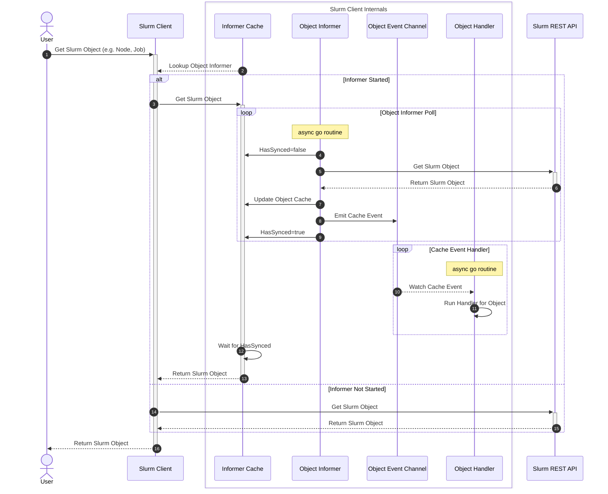

# Slurm Client

<!-- mdformat-toc start --slug=github --no-anchors --maxlevel=3 --minlevel=1 -->

- [Slurm Client](#slurm-client)
  - [Overview](#overview)
  - [Design](#design)
    - [Sequence Diagram](#sequence-diagram)

<!-- mdformat-toc end -->

## Overview

This Go library is responsible for enabling communication with [Slurm]. It
relies on communication with [slurmrestd] and `auth/jwt` based authentication
via the [rest-api].

## Design

The Slurm client abstracts the Slurm OpenAPI Spec endpoints and objects for easy
use. It supports a number of Slurm versions.

### Sequence Diagram

<!-- Links -->

[rest-api]: https://slurm.schedmd.com/rest_api.html
[slurm]: https://www.schedmd.com/slurm
[slurmrestd]: https://slurm.schedmd.com/slurmrestd.html
